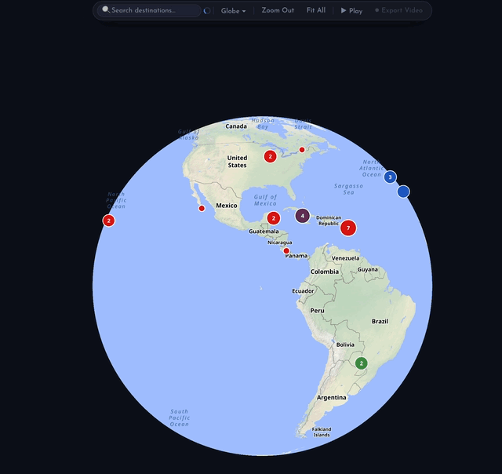
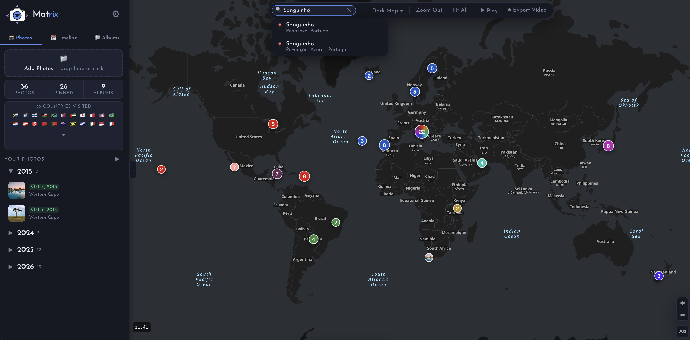
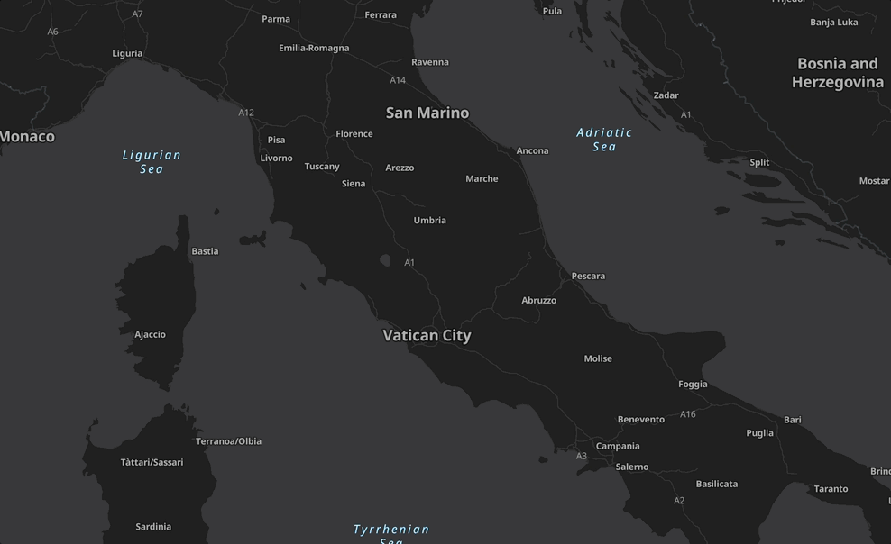
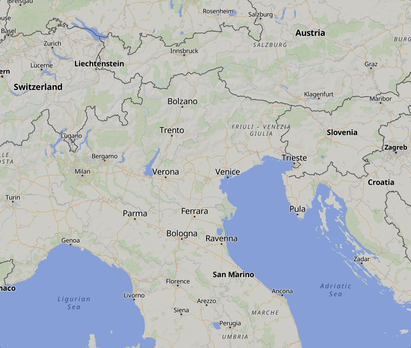

# Matrix

*A local-first travel photo mapping app. Runs entirely in your browser, no account needed.*



<details>
<summary>Interface</summary>


</details>

<details>
<summary>Dark Map Interaction</summary>


</details>

<details>
<summary>Pin a Location</summary>


</details>

## Quick Start

1. **Download** the repository (git clone it).

2. **Launch the server** (requires Python 3):
   ```bash
   python3 serve.py
   ```
   or
   ```bash
   ./start.command
   ```
   On first run, `serve.py` downloads vendor dependencies (MapLibre, fonts, etc.) into `vendor/`.
   Your browser will open automatically at **http://localhost:8765**

3. **Add photos** — drag & drop JPEG/HEIC files (with GPS data) onto the upload zone,
   or click it to browse your drive.

---

[](https://www.youtube.com/watch?v=w9MhBRoiUho)

---

## Features

| Feature | Detail |
|---|---|
| 📍 Auto-pin | Reads GPS EXIF data — no manual coordinates needed |
| 🔎 Destination search | Search for any place and pin photos to it |
| 🖱 Right-click pin | Right-click anywhere on the map to pin a location |
| 🏳 Countries visited | Shows flag emojis for all countries you've pinned photos in |
| 📁 Albums | Organise photos into named albums with date ranges |
| 🗓 Timeline | Browse pinned photos chronologically |
| 🖼 Lightbox | Full-size photo viewer with smooth navigation animations |
| 📝 Notes | Add notes to any pin location |
| 🛰 Map styles | Light, Dark, Terrain, 3D Terrain, Satellite, and Globe |
| 🗺 Vector tiles | Smooth zoom with no tile flickering (OpenFreeMap Liberty) |
| 🔄 Clustering | Nearby pins cluster automatically, expand on zoom |
| 💾 Auto-save | Automatic backup to disk when running via `serve.py` |
| 📦 Export / Import | Download or restore your full dataset as compressed `.json.gz` |
| 🎬 Video export | Export trip animations as WebM video (VP9 codec) |
| 📡 Offline mode | Browse photos and cached map tiles without internet |

## Auto-save & Persistence

- **IndexedDB** — all photos, albums, and metadata persist in the browser across sessions.
- **serve.py auto-save** — when running with the local server, data is also saved to `matrix-data.json` and photos to `matrix-photos/` on disk. This provides a durable backup that survives browser data clearing.
- **Export/Import** — use the settings menu to export your data as a gzip-compressed `.json.gz` file or import a backup. Importing supports both compressed (`.json.gz`) and plain (`.json`) files.

## Tile Caching

Map tiles are cached in a multi-layer architecture designed for fast rendering and offline access:

### Storage Layers

| Layer | What it is | Speed | Persistence | Browser support |
|---|---|---|---|---|
| **L1 — Cache API** | Browser-side HTTP response cache, managed by the service worker | Instant (~0ms) | Cleared with browser data | Chrome, Firefox (not Safari) |
| **L2 — Disk cache** | Local filesystem at `matrix-tiles/`, served by `serve.py` | Fast (~5-10ms) | Persists until manually deleted or evicted | All browsers |
| **L3 — Origin** | Remote tile servers (OpenFreeMap, ArcGIS) | Network-dependent (~50-200ms) | N/A | All browsers |

### How it works

**Chrome / Firefox (with service worker):**

```
MapLibre requests tile
    → SW intercepts
    → L1 check (Cache API) — instant hit if previously fetched
    → L1 miss: race L2 (disk proxy) and L3 (origin) via Promise.any
        → Whichever responds first wins
        → Result stored in L1 for future requests
        → Origin fetches saved to L2 in background
```

**Safari (no service worker):**

Safari's service worker implementation has persistent issues (premature context termination, stale caches, failed tile loads). The SW is intentionally disabled in Safari. Tiles flow directly:

```
MapLibre requests tile
    → Browser fetches from origin (L3)
    → Proactive caching (data.js) prefetches tiles via serve.py
    → Disk cache (L2) available for offline use via serve.py proxy
```

### Data Storage (separate from tile caching)

| Storage | What it stores | Used by |
|---|---|---|
| **IndexedDB** | Photos, albums, metadata, thumbnails, geo caches | App data layer (`dbPut()` / `dbGetAll()`) |
| **Disk (matrix-data.json)** | Auto-save backup of all app data | `serve.py` auto-save endpoint |
| **Disk (matrix-photos/)** | Full-size images and thumbnails | `serve.py` photo storage |

IndexedDB and photo storage are unaffected by the service worker — app data persists identically in all browsers.

### Tile cache configuration

- **Disk cache limit:** 500 MB with LRU eviction (oldest tiles removed down to 80% when limit exceeded)
- **Eviction runs:** at startup and after each new tile is cached
- **Eviction logging:** written to `matrix-requests.log`
- **SW Cache API limit:** 10,000 entries with zoom-aware LRU (low-zoom tiles z≤8 protected from eviction)

### URL-based versioning

Tile URLs include a version segment (e.g., `20260415_001001_pt`) that changes when OpenFreeMap rebuilds their tile set. Cached tiles are never stale — when tiles update, the style JSON points to new URLs, the cache naturally misses, and fresh tiles are fetched. Old versioned tiles are eventually evicted by LRU.

### Proactive caching

After app load (10s delay), tiles for the world overview (z0–3) and pinned photo locations (z4–14) are prefetched in small batches. Already-cached tiles are skipped. This runs in the background without blocking interactive map use.

## Video Export

The **Play** button animates the map between your pinned locations in chronological order. **Export Video** records this animation using the browser's `MediaRecorder` API and saves it as a `.webm` file (VP9 codec, 40 Mbps). WebM plays natively in Chrome, Firefox, and VLC. For Apple ecosystem apps (QuickTime, iMovie, Photos), convert with `ffmpeg -i trip.webm trip.mp4`.

## Offline Support

The app works offline after your first visit:

- **Vendor libraries** are bundled locally in `vendor/` (auto-downloaded on first `serve.py` run)
- **Map tiles** are served from the L1/L2 cache (see above) — previously viewed areas render without internet
- **Photos, albums, and timeline** work fully offline (stored in IndexedDB)
- **Destination search and geocoding** require internet — they show a friendly message when offline
- An **orange banner** appears at the top when you're offline
- When you reconnect, everything resumes automatically — no action needed

## Tips

- **JPEG photos from iPhones** almost always have GPS data embedded — they'll auto-pin perfectly.
- Photos **without GPS** still appear in the sidebar list and can be manually pinned via the metadata editor or destination search.
- **Right-click the map** to pin any location and add photos to it.
- **Countries visited** flags appear automatically as you click through your pins. Country codes are persisted so they load instantly on refresh.
- The app works in both **Chrome and Safari** on macOS.
- Nominatim (OpenStreetMap) is used for geocoding. Requests are rate-limited to 1 per second to comply with their usage policy.

## Testing

The app includes a Playwright integration test suite. Tests run against a temporary data directory so your real data is never touched.

**Prerequisites:** Node.js (for Playwright)

```bash
python3 serve.py --run-tests
```

Note: You may need to run `npx playwright install` first before executing the test suite

This will:
1. Create an isolated temp directory for test data
2. Generate test fixture images (with EXIF GPS data)
3. Install Playwright and Chromium (first run only)
4. Start the server and run all tests
5. Clean up and exit with the test result code

## Architecture: Map Stack

The app uses three separate services that work together to render interactive maps:

- **OpenStreetMap (OSM)** — the data source. A community-maintained database of geographic data (roads, buildings, boundaries, POIs). OSM provides the raw data but doesn't serve map tiles for app usage.
- **OpenFreeMap** — the tile server. Takes OSM's raw data, renders it into vector map tiles (`.pbf` files), and serves them alongside style definitions (JSON files that describe how to color roads, label cities, etc.). Free, no API key required. The app uses its `liberty` style (light) and `dark` style.
- **MapLibre GL JS** — the client-side rendering engine. A JavaScript library that takes tiles and style JSON from OpenFreeMap and renders an interactive, zoomable map on a `<canvas>` element in the browser. Handles panning, zooming, markers, clusters, and all map interaction.

The app offers six map styles:

| Style | Description |
|---|---|
| **Light Map** | Clean vector map with muted colors |
| **Dark Map** | Dark-themed vector map with normalized labels |
| **Terrain** | Light map with natural-earth shaded relief raster overlay |
| **3D Terrain** | True 3D elevation via AWS Terrain Tiles with hillshading. Pitch/bearing/exaggeration controls appear at bottom-left. Right-click shows elevation in meters. |
| **Satellite** | ArcGIS World Imagery raster tiles (Esri) |
| **Globe** | Spherical globe projection — pan to see the whole Earth |

The satellite and 3D Terrain views use separate raster tile sources unrelated to the OpenFreeMap/OSM ecosystem. 3D Terrain elevation data comes from **AWS Terrain Tiles** (free, no API key, terrarium encoding), capped at zoom 15 for maximum detail.

**Nominatim** (run by OpenStreetMap) is used for geocoding — converting place names to coordinates. Requests are rate-limited to 1 per second per their usage policy.

## Privacy

Everything stays **100% local**. No data is sent anywhere except OpenStreetMap/Nominatim for place lookups. No login required.

---

Built with [Claude Code](https://claude.ai/claude-code) using Claude Opus 4.6  
